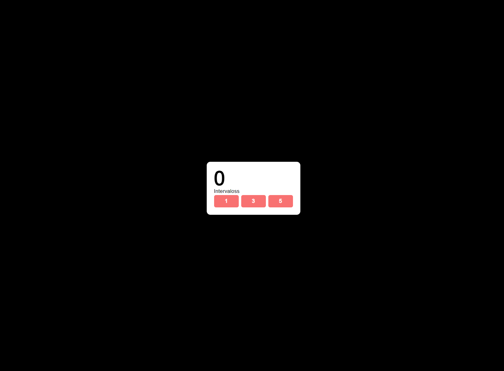

This is a [Next.js](https://nextjs.org/) project bootstrapped with [`create-next-app`](https://github.com/vercel/next.js/tree/canary/packages/create-next-app).

## Getting Started

First, run the development server:

```bash
npm run dev
# or
yarn dev
# or
pnpm dev
```

Open [http://localhost:3000](http://localhost:3000) with your browser to see the result.


initial state

## Test instructions

Modify the page.tsx file inside the app folder to meet the following conditions.

- When clicking on a number button, the counter will reset to 1, and it will increase by 1 every n seconds, where n is equal to the value on the button.

- When clicking on the Stop button, the counter should be set to 1, and it should no longer be incremented.

This test should be solved on max 60 minutes, Good luck ~

## Expected output
1 sec increment

https://github.com/SergioAVelasco/interview-examples-01/assets/2586947/4b44cbdf-4f25-4b69-a5c6-943fd440d7a3

3 secs increment

https://github.com/SergioAVelasco/interview-examples-01/assets/2586947/bf3aeb2d-5274-4b77-b9cd-7dd2d8603845

Stop 

https://github.com/SergioAVelasco/interview-examples-01/assets/2586947/4b0ed1cf-a487-4bee-875c-ae418d6d4263

